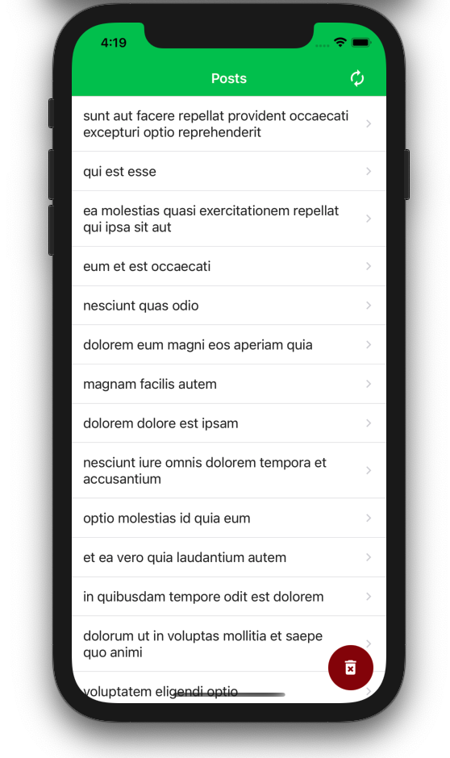

## Zemoga React Native Test
A simple mobile app written in React Native to read posts from [JSONPlaceholder](https://jsonplaceholder.typicode.com/).

Very basic but working approach using expo and react-native-elements. No offline support, no gestures, uploaded just for the record. Please refer to https://github.com/grissproject/reactnative-posts for the real version.

